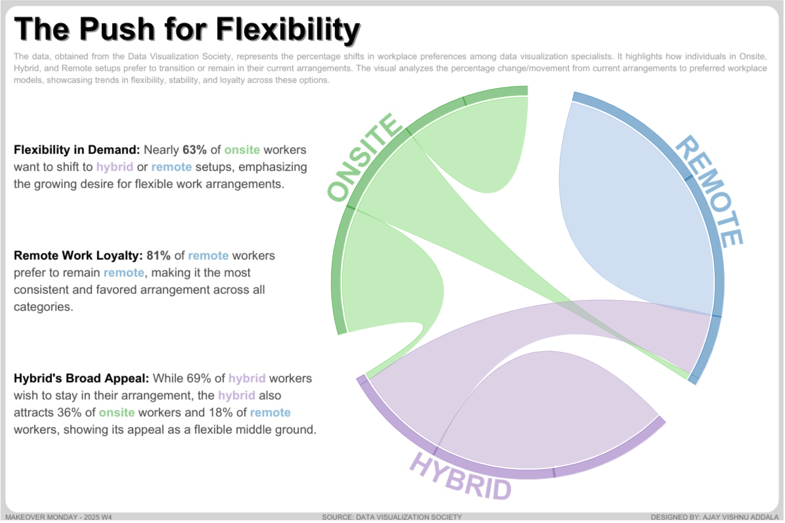

# Workplace Preferences Analysis: Chord Diagram

This project visualizes the shifting workplace preferences among data visualization specialists using a chord diagram. The analysis is based on data obtained from the **Data Visualization Society**, focusing on percentage changes from current to preferred work arrangements (Onsite, Hybrid, Remote). The dashboard highlights key trends in workplace flexibility and preferences.

## Dashboard Overview

### Key Insights
- **Flexibility in Demand**: Nearly **63% of onsite workers** want to shift to hybrid or remote setups.
- **Remote Work Loyalty**: **81% of remote workers** prefer to remain remote, making it the most consistent choice.
- **Hybrid's Broad Appeal**: **69% of hybrid workers** wish to stay hybrid, while hybrid also attracts **36% of onsite workers** and **18% of remote workers**.

### Data Source
The data was provided by the **Data Visualization Society** and represents the percentage shifts in workplace preferences among data visualization specialists.

## Snapshot

## Tableau Public Link
[Explore the Dashboard on Tableau Public](https://public.tableau.com/app/profile/ajay.vishnu.addala/viz/PushtowardsFlexibleworkarrangementsMOM2025W4/MOM2025-W4)

## Features
- **Chord Diagram**: Visualizes the movement from current to preferred workplace arrangements.
- **Interactive Filters**: Allow users to explore specific transitions and percentages.
- **Clear Insights**: Highlights key trends in workplace flexibility.

